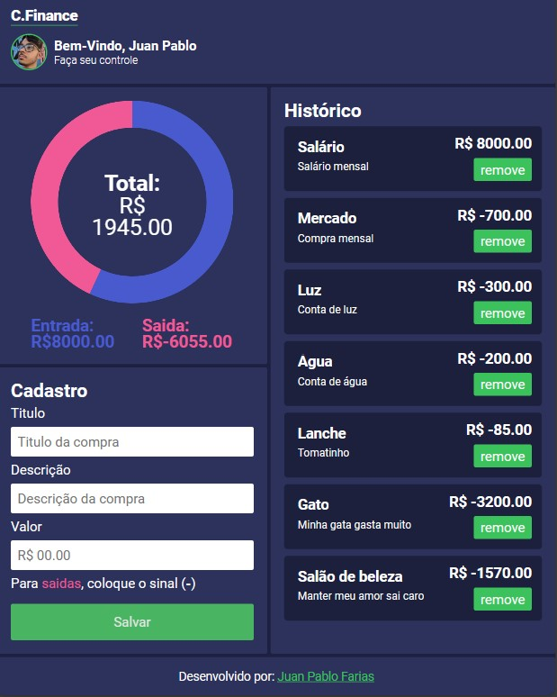

<h1 align="center">
    Finances - HTML, CSS && JavaScript
</h1>
<p align="center">Aplicação de um aplicativo de finanças</p>

Acesso o projeto online [clicando aqui](https://juanfariasdev.github.io/finances/)

## 🎯 Sobre o projeto

O projeto tem como objetivo treinar HTML, CSS e JavaScript.
Indo além das funções básicas do JavaScript.

---

```bash
# Execute o comando git clone para realizar o clone do repositório
$ git clone https://github.com/juanfariasdev/finances.git
# Entre na pasta do repositório clonado
$ cd finances
```

### **Iniciando o projeto**

Basta executar o arquivo Index.html

---

## Licença

Distribuído sob a licença MIT. Veja [LICENSE](LICENSE) para mais informações.

---

## Autor

Desenvolvido por [Juan Pablo Farias](https://juanpablofarias.com/) 👋

## Prints


